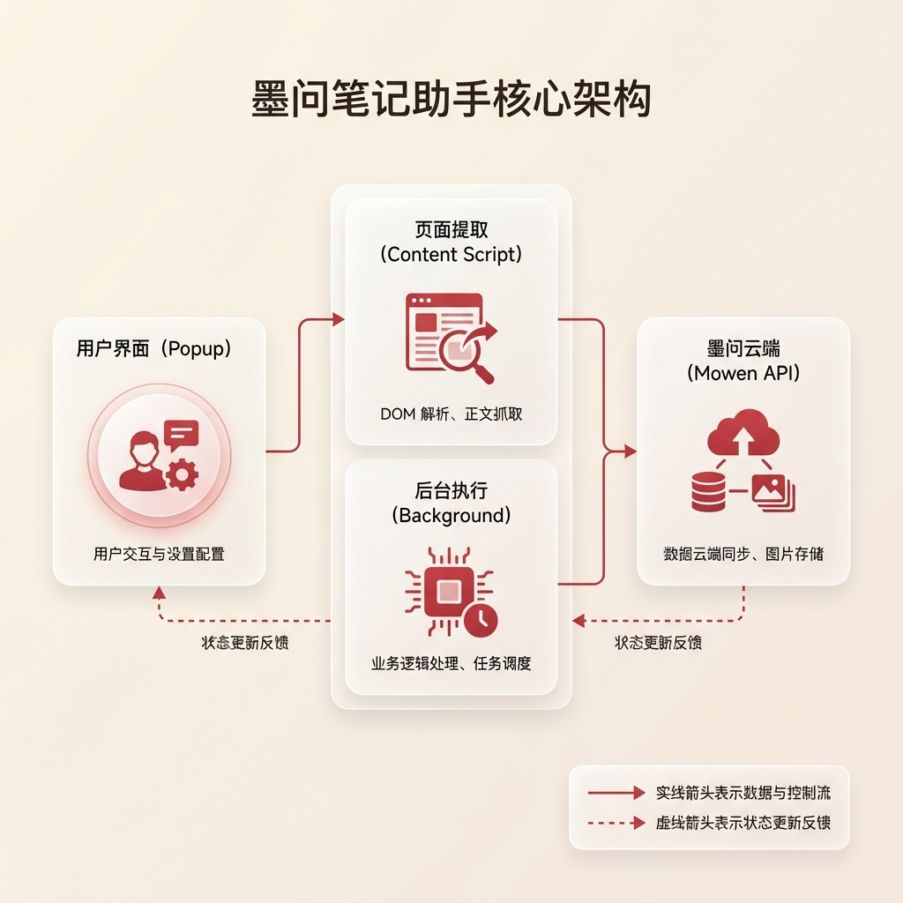

# 墨问笔记助手 Chrome 扩展

<p align="center">
  
</p>

<p align="center">
  <strong>一键剪藏网页/公众号文章到墨问笔记</strong><br>
  支持图片抓取、富文本格式保留、超长文章自动拆分
</p>

---

## ✨ 功能特性

| 功能 | 描述 |
|------|------|
| ✂️ **一键剪藏** | 支持微信公众号、新闻网站、技术博客等各类网页 |
| 🖼️ **智能图片处理** | 自动抓取并上传图片，失败时自动转为可点击链接 |
| 📝 **格式保留** | 保留原文标题、加粗、段落等富文本格式 |
| 📄 **超长文章拆分** | 超过 19,000 字自动拆分为多篇笔记，支持索引笔记 |
| 🔐 **权限可控** | 支持公开/私密设置，可配置默认权限 |
| 🔗 **原文链接** | 自动在笔记开头添加原文来源链接 |
| ⚡ **实时预览** | 保存前预览标题、字数、图片数量等信息 |

---

## 📦 安装方式

### 方式一：开发者模式安装

#### 1. 克隆项目并构建

```bash
# 克隆项目
git clone <repository-url>
cd mowen-plugin

# 安装依赖
npm install

# 构建生产版本
npm run build
```

#### 2. 加载扩展到 Chrome

1. 打开 Chrome 浏览器，访问 `chrome://extensions/`
2. 开启右上角的 **「开发者模式」** 开关
3. 点击 **「加载已解压的扩展程序」** 按钮
4. 选择项目的 `dist` 目录
5. 扩展安装成功，图标将出现在浏览器工具栏

### 方式二：开发模式（支持热更新）

```bash
# 启动开发服务器
npm run dev
```

开发模式下，修改代码后会自动重新构建，但需要在 `chrome://extensions/` 页面手动点击刷新按钮。

---

## ⚙️ 配置指南

### 首次配置

1. **点击扩展图标**，打开 Popup 弹窗
2. 如果未配置 API Key，会显示 **「去配置 API Key」** 按钮
3. 点击进入设置页面

### 获取 API Key

1. 访问 [墨问设置页面](https://mowen.cn/settings/api)
2. 登录您的墨问账号
3. 在 API 设置中生成或复制您的 API Key

### 配置 API Key

1. 在设置页面的 **「API 配置」** 卡片中输入 API Key
2. 点击 **「测试连接」** 按钮验证 Key 是否有效
3. 测试成功后会自动创建一篇测试笔记，并显示绿色成功提示
4. 点击 **「保存设置」** 按钮保存配置

> ⚠️ **注意**: 清空 API Key 并保存后，测试状态会被重置。

---

## 🚀 使用方法

### 剪藏文章

1. 打开要剪藏的网页（如微信公众号文章）
2. 点击浏览器工具栏中的 **「墨问笔记助手」** 图标
3. 扩展会自动提取页面内容并显示预览信息：
   - 文章标题
   - 字数统计
   - 图片数量
   - 将内嵌/转链接的图片数量
4. 根据需要调整快速设置：
   - **包含图片**：是否抓取并上传图片
   - **发布公开笔记**：设置笔记的公开/私密状态
5. 点击 **「保存到墨问」** 按钮
6. 等待保存完成，成功后会显示笔记链接

### 侧边栏模式

扩展也支持以侧边栏（Side Panel）形式使用，提供更大的操作空间。

---

## 📋 设置说明

### 基础设置

| 设置项 | 说明 | 默认值 |
|--------|------|--------|
| **API Key** | 墨问平台的 API 密钥，用于身份验证 | - |
| **默认笔记权限** | 新建笔记的默认可见性（公开/私密） | 私密 |
| **默认包含图片** | 剪藏时是否默认抓取图片 | 是 |
| **最大图片数量** | 单篇笔记内嵌图片的上限（0-200） | 20 |
| **创建索引笔记** | 长文拆分时是否创建包含所有分篇链接的索引 | 是 |

### 高级设置

| 设置项 | 说明 | 默认值 |
|--------|------|--------|
| **调试模式** | 在浏览器控制台输出详细日志，用于排查问题 | 否 |

---

## 🔧 技术架构

### 技术栈

- **扩展规范**: Chrome Extension Manifest V3
- **前端框架**: React 18 + TypeScript
- **构建工具**: Vite + @crxjs/vite-plugin
- **样式方案**: TailwindCSS
- **图标库**: lucide-react
- **内容提取**: @mozilla/readability

### 项目结构

```
mowen-plugin/
├── src/
│   ├── background/          # Service Worker（后台服务）
│   │   └── index.ts         # 消息处理、笔记保存、图片上传
│   ├── content/             # Content Script（内容脚本）
│   │   ├── index.ts         # 消息监听、自动提取入口
│   │   ├── extractor.ts     # 内容提取核心逻辑
│   │   ├── images.ts        # 图片提取与过滤
│   │   ├── imageNormalizer.ts # CDN URL 归一化（Substack/Medium/Twitter等）
│   │   └── imageFetcher.ts  # 图片数据获取（Base64）
│   ├── popup/               # Popup 弹窗
│   │   └── Popup.tsx        # 主界面、预览、保存操作
│   ├── options/             # 设置页面
│   │   └── Options.tsx      # API Key 配置、参数设置
│   ├── sidepanel/           # 侧边栏
│   │   └── index.tsx        # 复用 Popup 组件
│   ├── services/            # API 服务层
│   │   └── api.ts           # 墨问 API 调用（笔记创建、图片上传）
│   ├── types/               # TypeScript 类型定义
│   │   └── index.ts         # Settings、ExtractResult 等接口
│   ├── utils/               # 工具函数
│   │   ├── storage.ts       # Chrome Storage 封装
│   │   ├── noteAtom.ts      # HTML 转 NoteAtom 格式
│   │   ├── constants.ts     # 常量定义
│   │   └── helpers.ts       # 通用辅助函数
│   └── styles/              # 全局样式
│       └── index.css        # TailwindCSS 入口
├── public/
│   └── icons/               # 扩展图标 (16/32/48/128)
├── dist/                    # 构建输出目录
├── manifest.json            # 扩展配置文件
├── vite.config.ts           # Vite 配置
├── tailwind.config.js       # TailwindCSS 配置
└── package.json             # 项目依赖
```

### 核心流程



1. **用户操作**：点击 Popup 弹窗或保存按钮触发。
2. **页面提取**：Content Script 根据当前页面结构，智能提取正文、图片和元数据。
3. **后台执行**：Service Worker 接收提取的数据，处理逻辑，并依次调用墨问 API 上传图片和保存笔记。
4. **状态同步**：完成后将笔记链接和状态返回至 UI 界面，引导用户访问。

---

## 🧪 验收用例

### 配置管理
- [x] 未配置 API Key 时显示配置引导页面
- [x] 配置 API Key 后自动刷新 Popup 状态
- [x] 清空 API Key 后清除测试成功状态
- [x] 设置页面实时响应 API Key 变化

### 内容提取
- [x] 微信公众号文章提取
- [x] 通用网页 Readability 提取
- [x] 图片候选提取（img/srcset/懒加载/背景图）
- [x] 保留原文格式（标题、加粗、段落）
- [x] 自动添加原文来源链接

### 笔记创建
- [x] 单篇笔记创建
- [x] 超长文章自动拆分（≈19,000 字/篇）
- [x] 索引笔记创建（包含分篇链接）
- [x] 公开/私密权限控制

### 图片处理
- [x] URL 直接上传图片
- [x] 本地 Blob 上传图片（跨域情况）
- [x] 上传失败自动转为可点击链接
- [x] 超出最大数量的图片转为链接

---

## ❓ 常见问题

### Q: 点击「测试连接」没有反应？
**A**: 请检查：
1. API Key 是否正确复制（注意首尾空格）
2. 网络连接是否正常
3. 打开浏览器控制台（F12）查看错误信息

### Q: 保存笔记时提示「页面脚本未加载」？
**A**: 这通常是因为页面在扩展安装前已打开。请刷新页面后重试。

### Q: 图片没有保存成功？
**A**: 可能的原因：
1. 图片有防盗链保护
2. 图片 URL 无法直接访问
3. 图片数量超过最大限制

扩展会自动将上传失败的图片转为可点击链接，不影响笔记保存。

### Q: 超长文章如何拆分？
**A**: 扩展会自动按段落边界将超过 19,000 字的文章拆分为多篇笔记，并可选创建一篇索引笔记，包含所有分篇的链接。

---

## 🔄 更新日志

### v0.3.2 (2026-01-21)
- ✨ 新增：合集笔记改为**原生内链卡片**格式，体验更顺滑
- ✨ 新增：**X (Twitter) 专用提取器**，完美解析推文、引用推文及 X Article 长文
- ✨ 新增：**强力图片抓取**，绕过微信/B站防盗链，直接上传图片到墨问
- 🐛 修复：长文拆分逻辑优化（基于纯文本长度），避免内容被错误切断
- ⚡ 优化：清理 400+ 处冗余日志，提升运行性能
- ⚡ 优化：API 请求增加智能速率限制，防止批量操作报错

### v0.3.1 (2026-01-16)
- 🐛 修复：Substack 图片重复提取问题（10张→2张）
- 🔧 优化：srcset 解析支持含逗号的 CDN URL（Substack/Cloudflare等）
- 🔧 优化：图片尺寸过滤增加 width/height 属性回退
- ♻️ 重构：内容提取模块化拆分
  - `extractor.ts` - 内容提取核心
  - `images.ts` - 图片提取与过滤
  - `imageNormalizer.ts` - CDN URL 归一化
  - `imageFetcher.ts` - 图片数据获取

### v0.3.0
- ✨ 新增：自动添加原文来源链接
- ✨ 新增：设置变更时 Popup 自动刷新
- 🐛 修复：清空 API Key 后仍显示连接成功
- 🐛 修复：多图片显示为链接的问题
- 🎨 优化：笔记格式保留更完整

### v0.2.0
- ✨ 新增：Side Panel 侧边栏模式
- ✨ 新增：索引笔记功能
- 🐛 修复：图片上传失败处理
- 🎨 优化：UI 视觉体验

### v0.1.0
- 🎉 首次发布
- ✨ 基础剪藏功能
- ✨ API Key 配置
- ✨ 图片上传

---

## 📄 许可证

MIT License

---

## 🤝 贡献

欢迎提交 Issue 和 Pull Request！

1. Fork 本仓库
2. 创建特性分支 (`git checkout -b feature/AmazingFeature`)
3. 提交更改 (`git commit -m 'Add some AmazingFeature'`)
4. 推送到分支 (`git push origin feature/AmazingFeature`)
5. 提交 Pull Request

---

<p align="center">
  Made with ❤️ for <a href="https://mowen.cn">墨问</a>
</p>
